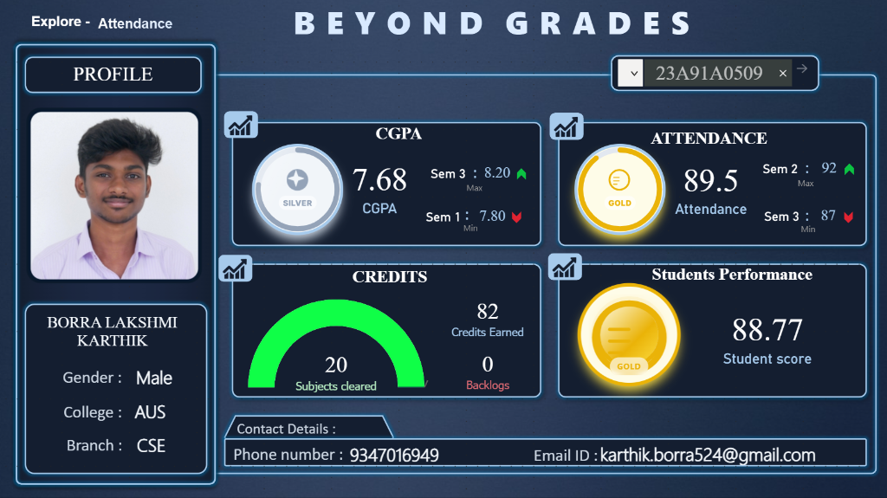
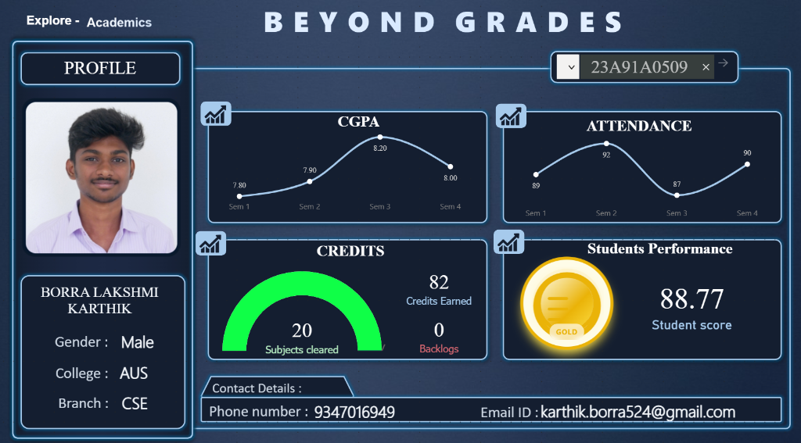
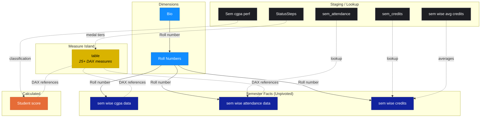
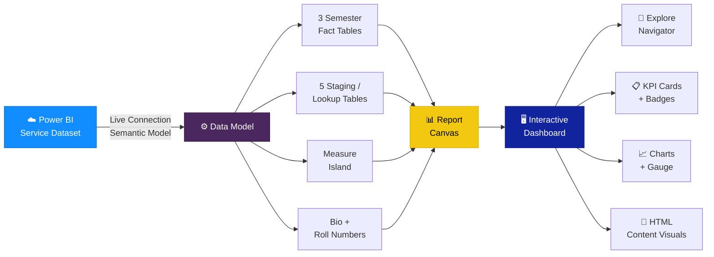

# 🎓 Beyond Grades — Student Performance Dashboard


> A single-page Power BI dashboard that gives academic advisors and students an instant, interactive view of semester-wise CGPA, attendance, credits, and overall performance — powered by bookmark-driven state switching, gamified achievement badges, and custom HTML visuals for a premium portfolio-grade experience.

---

## 📊 Dashboard Preview



<details>
<summary>📈 Academics View (line chart toggle)</summary>



</details>

---

## 📋 Project Overview

| Attribute | Detail |
|-----------|--------|
| **Tool** | Microsoft Power BI Desktop (June 2026) |
| **Theme** | CY25SU11 (Fabric base theme) |
| **Canvas** | 1280 × 720 px (16:9, Fit to Page) |
| **Pages** | 1 (Main page) |
| **Data Source** | Power BI Service semantic model (remote dataset) |
| **Refresh** | Automatic via Power BI Service (no local refresh) |
| **Report Version** | 2.0.0 (Fabric definition format) |

---

## ✨ Features

- **3-state Explore navigator** — bookmark-driven switcher between Performance, Attendance, and Academics views
- **Gamified achievement system** — Novice / Silver / Gold badges and medals driven by the `StatusSteps` lookup table
- **6 HTML Content visuals** — custom-rendered dashboard title, animated subtitle, profile card, CGPA badge, attendance badge, and performance medal (Daniel Marsh-Patrick's HTML Content v1.6.0)
- **Star-like data model** — 12 tables: 3 unpivoted semester fact tables, 5 staging/lookup tables, 1 Bio dimension, 1 score table, 1 config table, 1 measure island
- **Semester trend line charts** — CGPA and Attendance trends across 4 semesters (visible in Academics view)
- **Gauge visual** — subjects cleared vs total subjects with green progress arc
- **Min / Max semester indicators** — best and worst semesters with green ↑ and red ↓ arrows
- **Roll number text slicer** — search and select any student by roll number
- **Dynamic profile card** — HTML-rendered student photo, name, and identity details
- **Contact section** — phone number and email displayed at the footer
- **Dark-themed canvas** — deep navy (`#12239E`) background with branded SVG overlay for modern aesthetics
- **Cross-filtering** enabled globally across all visuals

---

## 🎯 Business Problem

Academic institutions need a consolidated, at-a-glance view of individual student performance that goes beyond raw grade sheets. Advisors want to instantly see a student's CGPA trajectory, attendance consistency, credit accumulation, and risk indicators (backlogs) — all from a single search. This dashboard transforms scattered semester records into an interactive, gamified experience where performance tiers (Novice → Silver → Gold) make academic standing immediately intuitive, and the three-state explorer lets users drill from high-level metrics into semester-by-semester trends with a single click.

---

## 📄 Dashboard Pages

This is a **single-page dashboard** with a **3-state Explore navigator** and six visual zones:

```
┌─────┬──────────────────────────────────────────────────────────────┬──────────┐
│LOGO │  BEYOND GRADES  (HTML title + animated subtitle)            │ SLICER   │
│badge│                                                             │ Roll No. │
├─────┴────┬─────────────────────────────────┬──────────────────────┴──────────┤
│ PROFILE  │         CGPA CARD               │       ATTENDANCE CARD           │
│          │  Badge (Novice/Silver/Gold)      │  Badge (Novice/Silver/Gold)     │
│  Photo   │  CGPA value                     │  Attendance %                   │
│  Name    │  MAX: semester ↑  MIN: sem ↓    │  MAX: semester ↑  MIN: sem ↓    │
│          │  — OR (Academics view) —         │  — OR (Academics view) —        │
│  Gender  │  Line chart (4 semesters)       │  Line chart (4 semesters)       │
│  College ├─────────────────────────────────┼─────────────────────────────────┤
│  Branch  │         CREDITS CARD            │    STUDENTS PERFORMANCE         │
│          │  Gauge (subjects cleared/total)  │  Medal (Novice/Silver/Gold)     │
│          │  Credits Earned · Backlogs       │  Student score                  │
├──────────┴─────────────────────────────────┴─────────────────────────────────┤
│  CONTACT SECTION  ·  Phone number  ·  Email ID                               │
└──────────────────────────────────────────────────────────────────────────────┘
```

### Explore States (bookmark-driven)

| State | What Changes | Key Visuals |
|-------|-------------|-------------|
| **Performance** | CGPA & Attendance cards show achievement badges + gauge | Badges, medals, gauge arc |
| **Attendance** | Same layout with attendance-focused highlight | Badges, min/max indicators |
| **Academics** | CGPA & Attendance cards switch to semester line charts | Line charts (Sem 1–4 trends) |

---

## 📈 Key KPIs

| KPI | Measure | Icon | Description |
|-----|---------|------|-------------|
| **CGPA** | `Student_cgpa` | 🎓 | Overall cumulative GPA (e.g. 7.68) |
| **Attendance** | `Student_attendance` | 📊 | Overall attendance percentage (e.g. 89.5%) |
| **Credits Earned** | `Student_credits` | 📚 | Total credits accumulated (e.g. 82) |
| **Subjects Cleared** | `Student_subjectscleared` | ✅ | Subjects passed out of 24 total |
| **Backlogs** | `Student_backlogs` | ⚠️ | Active backlog count (0 = clean record) |
| **Student Score** | `Student_performance_score` | 🏆 | Composite performance score (e.g. 88.77) |

### Achievement Tiers

| Tier | Badge | Criteria |
|------|-------|----------|
| 🥉 **Novice** | Grey badge | Entry level / no student selected |
| 🥈 **Silver** | Silver badge | Mid-range performance |
| 🥇 **Gold** | Gold badge/medal | Top-tier performance |

---

## ❓ Business Questions Answered

| # | Business Question | Visual |
|---|-------------------|--------|
| 1 | What is a student's overall academic standing at a glance? | KPI cards + badges |
| 2 | How has CGPA trended across semesters? | Line chart (Academics view) |
| 3 | How has attendance trended across semesters? | Line chart (Academics view) |
| 4 | Which semester had the best / worst CGPA? | Min/Max indicator cards |
| 5 | Which semester had the best / worst attendance? | Min/Max indicator cards |
| 6 | What percentage of subjects has the student cleared? | Gauge visual (e.g. 20/24) |
| 7 | Does the student have any active backlogs? | Backlogs card |
| 8 | What is the student's composite performance tier? | Medal badge (Novice/Silver/Gold) |
| 9 | What are the student's contact details? | Contact section |
| 10 | How does a specific student compare against performance thresholds? | Achievement tier system |

---

## 🗂️ Data Model

The data model follows a **star-like schema** — unpivoted semester fact tables, staging/lookup dimensions, a Bio dimension, and one isolated measure island.



> **Why a disconnected Measure Island?** All 25+ DAX measures are stored in an isolated `table` — a best practice that separates business logic from raw data columns and keeps the field list clean. Every card, badge, gauge, and HTML renderer pulls from this single measure container.

> **Why unpivoted semester tables?** The `sem wise cgpa data` and `sem wise attendance data` tables store semester data in a long (Attribute/Value) format, which is the optimal structure for Power BI line charts to show semester-by-semester trends without needing separate columns per semester.

---

## 🏗️ Architecture



---

## 🛠️ Tech Stack

| Technology | Usage |
|------------|-------|
| **Power BI Desktop** | Report authoring, data modelling, DAX measures |
| **Power BI Service** | Semantic model hosting, data refresh, live connection |
| **Power Query (M)** | Data extraction, transformation, and loading |
| **DAX** | Business logic — SELECTEDVALUE, MINX, MAXX, CALCULATE, DIVIDE, IF |
| **HTML Content Visual** | Custom HTML/CSS rendering for profile cards, badges, titles |
| **Star Schema** | Data model design pattern (unpivoted semester facts) |
| **Git + GitHub** | Version control and portfolio hosting |

---

## 📁 Repository Structure

```
student-performance-dashboard/
│
├── README.md                        ← Project overview (this file)
├── LICENSE                          ← MIT License
├── .gitignore                       ← Excludes temp/raw data files
├── Student Performance Analytics Dashboard.pbix ← Main Power BI report file
│
├── assets/
│   ├── banner.png                       ← Project banner
│   └── screenshots/
│       ├── dashboard-overview.png       ← Dashboard screenshot (Performance view)
│       ├── academics-view.png           ← Academics view with line charts
│       └── performance-analysis.png     ← Secondary analysis screenshot
│
├── docs/
│   ├── business-problem.md          ← Business context and questions
│   ├── dashboard-guide.md           ← Overview of visual zones
│   ├── architecture.md              ← Architecture and tech stack
│   ├── data-model.md                ← Data model design
│   ├── data-dictionary.md           ← Column definitions & data types for all 12 tables
│   ├── dax-reference.md             ← All 25+ DAX measures with descriptions
│   ├── interview-prep.md            ← Technical Q&A for hiring conversations
│   ├── performance-optimization.md  ← Rendering optimizations
│   └── future-enhancements.md       ← Planned features
│
└── data-sample/
    └── student-data-sample.csv      ← Anonymised synthetic sample (20 records)
```

---

## 📚 Documentation

| Document | Description |
|----------|-------------|
| [🎯 Business Problem](docs/business-problem.md) | Business problem statement and answers |
| [🧭 Dashboard Guide](docs/dashboard-guide.md) | Overview of visual zones and navigation |
| [🏗️ Architecture](docs/architecture.md) | Scalable architecture design and tech stack |
| [🗂️ Data Model](docs/data-model.md) | Star-like schema design and rationale |
| [📖 Data Dictionary](docs/data-dictionary.md) | Column definitions, data types, and table descriptions for all 12 tables in the model |
| [📐 DAX Reference](docs/dax-reference.md) | All 25+ DAX measures with business context, grouped by purpose |
| [🎤 Interview Prep](docs/interview-prep.md) | 16 technical Q&A pairs mapped to common BI/Data Analyst interview questions |
| [⚡ Performance Optimization](docs/performance-optimization.md) | Best practices used to optimize rendering |
| [🔮 Future Enhancements](docs/future-enhancements.md) | Planned features and improvements |

---

## 🚀 Getting Started

### Prerequisites

- [Power BI Desktop](https://powerbi.microsoft.com/desktop/) (free download)
- Windows 10 / 11
- Power BI Service account (for live data connection)

### Quick Start

```bash
# 1. Clone this repository
git clone https://github.com/Borrakarthik509/student-performance-dashboard.git
cd student-performance-dashboard

# 2. Open the report
#    Double-click 'Student Performance Analytics Dashboard.pbix'  OR  open Power BI Desktop → File → Open
```

Once open in Power BI Desktop:

1. **Home → Transform data → Data source settings** — verify the dataset connection points to the correct Power BI Service workspace
2. **Enter a Roll Number** in the slicer (top-right) to load a student's data
3. **Use the Explore navigator** (top-left) to switch between Performance, Attendance, and Academics views

> **Note:** This report connects to a published Power BI Service semantic model. Data will only render when connected to the Service. If you don't have access to the original dataset, use the [sample data](data-sample/student-data-sample.csv) to understand the schema and create your own local dataset.

---

## 🔮 Future Improvements

| Priority | Enhancement | Effort |
|----------|-------------|--------|
| 🔴 High | Add a date slicer for semester-on-semester trend filtering | Low |
| 🔴 High | Implement Row-Level Security for multi-advisor / multi-department views | Medium |
| 🟡 Medium | Add a Batch Overview page with class-level statistics and rankings | Medium |
| 🟡 Medium | Replace implicit measures with explicit DAX (`CALCULATE`, `AVERAGEX`, `RANKX`) | Low |
| 🟡 Medium | Add a Platinum tier to the achievement system for top 5% performers | Low |
| 🟢 Low | Publish to Power BI Service and embed a live link in this README | Low |
| 🟢 Low | Add conditional formatting to KPI cards (green / amber / red thresholds) | Low |
| 🟢 Low | Export to Power BI Embedded for public portfolio showcase | Medium |

---

## 👤 Author

**Lakshmi Karthik Borra**
Data Specialist · Power Platform Developer · Full-Stack AI Developer

[](https://github.com/Borrakarthik509)
[](https://www.linkedin.com/in/karthik524/)
[](mailto:karthik.borra524@gmail.com)

---

## 📄 License

This project is released under the [MIT License](LICENSE).

The data used in this dashboard is either synthetically generated or anonymised for demonstration purposes. No personally identifiable student information is included in the sample data.
