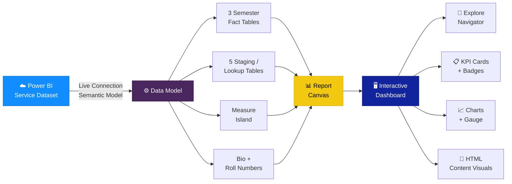

# Architecture

The dashboard is built on a scalable and modular architecture leveraging Power BI best practices.

## Tech Stack

| Technology | Usage |
|------------|-------|
| **Power BI Desktop** | Report authoring, data modelling, DAX measures |
| **Power BI Service** | Semantic model hosting, data refresh, live connection |
| **Power Query (M)** | Data extraction, transformation, and loading |
| **DAX** | Business logic — SELECTEDVALUE, MINX, MAXX, CALCULATE, DIVIDE, IF |
| **HTML Content Visual** | Custom HTML/CSS rendering for profile cards, badges, titles |
| **Star Schema** | Data model design pattern (unpivoted semester facts) |
