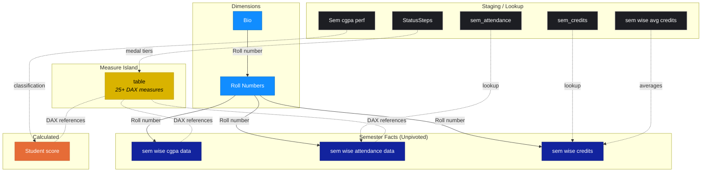

# Data Model

The data model follows a **star-like schema** — unpivoted semester fact tables, staging/lookup dimensions, a Bio dimension, and one isolated measure island.

> **Why a disconnected Measure Island?** All 25+ DAX measures are stored in an isolated `table` — a best practice that separates business logic from raw data columns and keeps the field list clean. Every card, badge, gauge, and HTML renderer pulls from this single measure container.

> **Why unpivoted semester tables?** The `sem wise cgpa data` and `sem wise attendance data` tables store semester data in a long (Attribute/Value) format, which is the optimal structure for Power BI line charts to show semester-by-semester trends without needing separate columns per semester.
